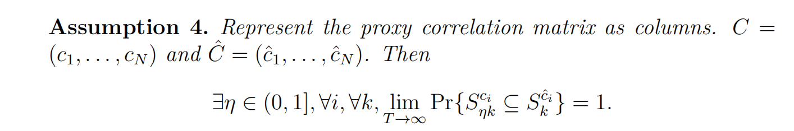
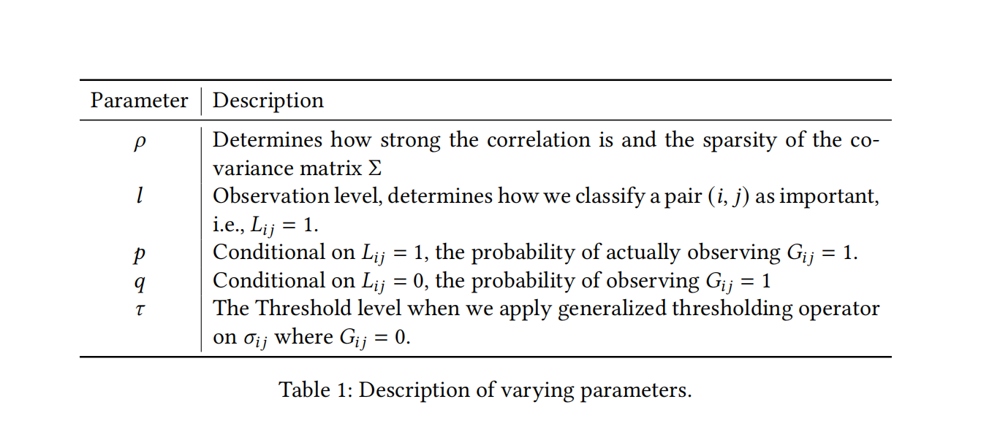

On February 5th, we talked about 4 situations in the simulation:
* $L$ matrix (binary-valued) + Network Guided Thresholding (already done)
* $C$ matrix (continuous) + NG Banding (already done)
* $L$ matrix + NG Banding
* $C$ matrix + NG Thresholding

#### Q1

I think the 3rd situation "$L$ + NG Banding" is unfeasible, because we cannot know any ordering from a binary-valued information matrix.

#### Q2

The 4th situation "$C$ + NG Thresholding". We must convert $\hat C(\eta)$ into $\hat L(l,p,q)$, where $\eta$ is

and $l, p, q$ are
 
($G$ matrix in the old version notation is $\hat L$ in the new version notation.)

##### Q2.1

But there isn't an one-to-one match between $\hat C$ and $\hat L$. 

##### Q2.2

You may think we can just pretend $\hat L_{fake} := I(i \in S^{\hat c_j}_k \land j \in S^{\hat c_i}_k)$, where $\hat c_i$ is the $i$-th column of $\hat C$ and $k$ is determined by the CV of NG Banding, then apply NG Thresholding. 

But then, the only difference between the two methods is whether we apply thresholding on $\hat \sigma_{ij}$ where $\hat L_{fake}=0$. 
